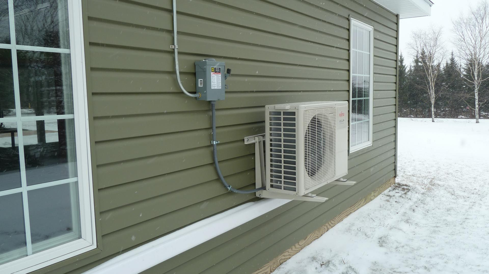

Rosnące ceny energii sprawiają, że efektywność energetyczna przestała być tematem niszowym — dziś to jeden z pierwszych pytań, jakie zadają kupujący oglądający nowe nieruchomości. W tym artykule wyjaśniamy, na co realnie warto zwrócić uwagę i jak te elementy przekładają się na koszty utrzymania domu w perspektywie wielu lat.

## Izolacja — fundament, nie dodatek

Zanim w ogóle zaczniemy mówić o pompach ciepła czy fotowoltaice, warto zrozumieć, że żadne z tych rozwiązań nie zadziała optymalnie bez dobrej izolacji budynku. Ściany, dach i stolarka okienna o niskich parametrach izolacyjności sprawiają, że nawet najlepsza pompa ciepła będzie pracować nieefektywnie, zużywając więcej energii niż powinna.

Przy ocenie nieruchomości warto zapytać dewelopera o konkretne parametry izolacyjności przegród (współczynnik U), a nie tylko o ogólną klasę energetyczną budynku.

## Pompy ciepła jako standard

Pompa ciepła stała się w ostatnich latach podstawowym źródłem ogrzewania w nowym budownictwie — i to nie przypadkiem. W porównaniu do tradycyjnych kotłów, pompa ciepła pozwala znacząco obniżyć koszty ogrzewania, szczególnie w połączeniu z dobrą izolacją i instalacją fotowoltaiczną.

Warto zwrócić uwagę na klasę efektywności energetycznej samej pompy (współczynnik COP) oraz na to, czy instalacja została prawidłowo dobrana do metrażu i charakterystyki budynku — źle dobrana pompa ciepła może generować wyższe koszty niż się spodziewano.

## Fotowoltaika — inwestycja, która się zwraca

Instalacja fotowoltaiczna, szczególnie połączona z pompą ciepła, pozwala znacząco zredukować rachunki za energię, a w wielu przypadkach niemal je wyzerować w miesiącach o dużym nasłonecznieniu. To także realny argument przy ewentualnej odsprzedaży nieruchomości — kupujący coraz częściej postrzegają fotowoltaikę jako standard, a nie luksusowy dodatek.

## Jak to przekłada się na wartość nieruchomości

Nieruchomości o wysokiej klasie energetycznej:

- generują niższe miesięczne koszty eksploatacji, co bezpośrednio wpływa na zdolność kredytową kupujących,
- łatwiej się wynajmują — najemcy coraz częściej pytają o rachunki za ogrzewanie już na etapie oglądania mieszkania,
- zachowują wyższą wartość rynkową w dłuższej perspektywie, w miarę zaostrzania się wymogów regulacyjnych dotyczących efektywności energetycznej budynków.

W realizacjach MM Invest efektywność energetyczna jest uwzględniana już na etapie projektu architektonicznego — od doboru materiałów izolacyjnych, przez orientację budynku względem stron świata, po standardowe wyposażenie w pompy ciepła i instalacje fotowoltaiczne. Jeśli chcesz dowiedzieć się więcej o parametrach energetycznych naszych aktualnych realizacji, zapraszamy do kontaktu.