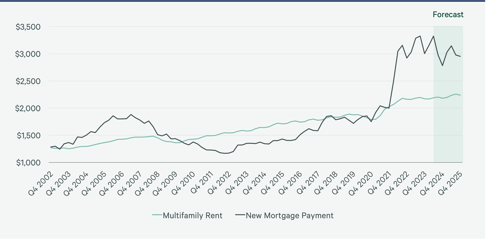

Rynek nieruchomości w 2026 roku przechodzi wyraźną zmianę. Po latach dynamicznych wzrostów cen obserwujemy stabilizację, a punkt ciężkości przesuwa się z samego faktu posiadania nieruchomości na jej jakość, lokalizację i koszty eksploatacji w dłuższej perspektywie. Inwestorzy — zarówno indywidualni, jak i instytucjonalni — coraz częściej pytają nie „ile to będzie kosztować", ale „ile będzie kosztować utrzymanie przez najbliższe dwadzieścia lat".

## Rosnące znaczenie lokalizacji

Lokalizacja od zawsze była kluczowym czynnikiem w wycenie nieruchomości, ale w 2026 roku definiujemy ją inaczej niż jeszcze pięć lat temu. Bliskość centrum miasta przestaje być jedynym wyznacznikiem atrakcyjności — coraz większą wagę zyskuje dostęp do komunikacji publicznej, terenów zielonych oraz infrastruktury umożliwiającej pracę zdalną i hybrydową.

Inwestorzy szczególnie uważnie przyglądają się lokalizacjom, które łączą spokój z dobrą dostępnością komunikacyjną — miejscowościom podmiejskim z bezpośrednim połączeniem kolejowym lub drogowym do większych ośrodków. To właśnie tam obserwujemy obecnie największą dynamikę zainteresowania.

## Efektywność energetyczna jako standard, nie dodatek

Jeszcze niedawno wysoka klasa energetyczna budynku była argumentem marketingowym. Dziś staje się warunkiem koniecznym. Rosnące koszty energii oraz zaostrzające się wymogi regulacyjne sprawiają, że nieruchomości o niskim zapotrzebowaniu na energię zyskują wyraźną przewagę — zarówno w oczach kupujących na własne potrzeby, jak i inwestorów liczących zwrot z najmu.

Pompy ciepła, fotowoltaika i dobra izolacja przestały być opcją premium — stają się standardem, którego oczekują kupujący porównujący oferty różnych deweloperów.

## Elastyczność układu mieszkań

Zmienia się też podejście do samego projektowania mieszkań. Sztywne układy funkcjonalne ustępują miejsca rozwiązaniom, które łatwo dostosować do zmieniających się potrzeb domowników — pracy zdalnej, powiększającej się rodziny czy wynajmu części powierzchni. Elastyczne strefy, dodatkowe pomieszczenia wielofunkcyjne i przemyślane doświetlenie stają się realnym argumentem sprzedażowym.

## Co to oznacza dla inwestorów

Dla osób planujących zakup nieruchomości inwestycyjnej w 2026 roku najważniejsze wnioski są następujące:

- warto stawiać na lokalizacje z dobrą komunikacją, nawet kosztem większego dystansu od centrum,
- efektywność energetyczna bezpośrednio przekłada się na atrakcyjność najmu i wartość odsprzedaży,
- elastyczne układy mieszkań zwiększają grono potencjalnych najemców i kupujących,
- horyzont inwestycyjny warto liczyć w dekadach, nie w kwartałach.

W MM Invest te trendy uwzględniamy już na etapie planowania każdej nowej realizacji — od wyboru lokalizacji, przez projekt architektoniczny, po standard wykończenia. Jeśli zastanawiasz się nad inwestycją w nieruchomość w najbliższym czasie, zapraszamy do kontaktu — chętnie podzielimy się szczegółową analizą naszych bieżących projektów.